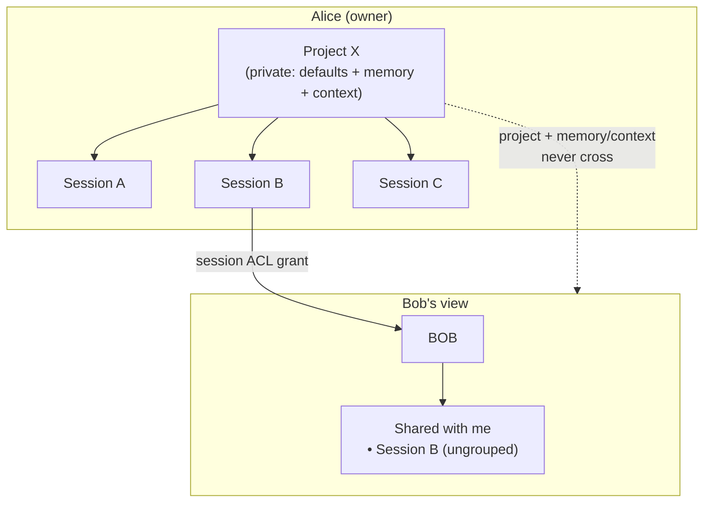

# PRD: Projects

- Status: Draft
- Author: Serena Ruan
- Related: [`designs/SESSION_PROJECTS_SIDEBAR.md`](./SESSION_PROJECTS_SIDEBAR.md) (v1, label-based sidebar grouping), issue [#863](https://github.com/omnigent-ai/omnigent/issues/863), PR [#869](https://github.com/omnigent-ai/omnigent/pull/869)

## 1. Overview

A **Project** is a user-defined container that groups related sessions and
carries owner-private configuration (memory, context, a default working
directory). It gives users a durable "workspace" above the single session, so
recurring work isn't re-configured each time or scattered across a flat list.

This PRD scopes the **full vision**. A **v1** already exists (§4): projects as a
reserved `omni_project` label, grouped in the sidebar — this covers grouping
only. Everything else (empty projects, rename/reorder, memory/context/defaults)
requires promoting Project from a *label* to a *first-class entity*.

Two decisions shape the whole design and are worth stating up front:
- **A project is owner-private metadata.** Sharing stays **per-session** exactly
  as it is today; there is **no project-level ACL** (§9).
- **Memory & context are owner-private** and never cross to a shared session's
  recipient. A shared session appears **ungrouped** to the recipient (§9).

## 2. Summary — what we support & UX impact

Priority order (highest first), per product direction:

| # | Capability | Support? | Mechanism | UX impact |
|---|---|---|---|---|
| 1 | **Create empty project** | ✅ | first-class `projects` table (needed for empty) | Always-visible **Projects** section in the sidebar; "New project" creates one with zero sessions |
| 2 | **Move session in / create session in project** | ✅ | `project_id` FK on session | Session-row kebab "Add to / Move / Remove from project"; "New session here" from a project header, pre-filling its defaults |
| 3 | **Rename projects** | ✅ | `PATCH /projects/{id}` on `name` (members untouched) | Inline rename from the project header |
| 4a | **Default working dir / host / harness** | ✅ (soft hints) | default columns on project | "New session here" pre-fills the new-chat dialog; unsatisfiable hints (host offline / not owned) are silently dropped |
| 4b | **Project memory** (owner-private) | ✅ | DB-backed, scoped to project, host-agnostic | Agent accumulates learnings across the project's sessions; never exposed to shared-session recipients |
| 4c | **Project context** (owner-private) | ✅ | curated docs/instructions attached to project | Owner-curated inputs seed each session started in the project |
| 5 | **Project-level sharing / ACL** | ❌ intentional | — | Sharing stays **per-session** (existing ACL). A shared session appears **ungrouped** in the recipient's "Shared with me" — no project, no memory/context |
| opt | **Reorder projects** | 🔵 optional | client-only (localStorage, no DB column) | Drag-to-reorder in the sidebar; nice-to-have, not required for launch — see §7.2 |

**Two-line model:**
- Project = **owner-private organizer** carrying defaults + memory + context.
- Sharing = **per-session only**; a shared session crosses the ACL boundary, its
  project membership and memory/context do **not**.

## 3. Where we are today (grounding)

The exploration of the current codebase established the following, which every
requirement below builds on:

- **Session = `Conversation`** (`omnigent/entities/conversation.py`). Key fields:
  `id`, `title`, `runner_id`, `host_id`, `workspace` (absolute path, **immutable
  after creation**), `git_branch`, `model_override`, `reasoning_effort`,
  `harness_override`, `cost_control_mode_override`, `labels`, `session_state`,
  `archived`.
- **Session creation** goes through `POST /v1/sessions`
  (`SessionCreateRequest`, `omnigent/server/schemas.py`) with `agent_id`,
  `host_type` (`external` | `managed`), `host_id`, `workspace`, optional `git`
  worktree spec, and per-session overrides. UX lives in
  `web/src/shell/NewChatDialog.tsx`.
- **Working directory & host**: `workspace` is a path on a `host` (a machine
  running `omnigent host`, or a server-managed sandbox). Bound at creation,
  immutable thereafter. Git worktrees are opt-in at create time.
- **Memory/context today**: only `session_state` (per-session key/value for
  policy callables) and `session_usage`. There is **no cross-session or
  project-level memory** and no shared context store.
- **Permissions**: per-`(user_id, conversation_id)` rows with levels
  read(1)/edit(2)/manage(3)/owner(4) (`omnigent/db/db_models.py`,
  `omnigent/entities/permission.py`). `__public__` sentinel grants public read.
  No org/team model. `workspace_id` is a multi-tenancy partition key, not a
  user-facing grouping.
- **Projects v1 already exists**: reserved label `omni_project` in
  `conversation_labels`; endpoints `GET /v1/sessions/projects` and
  `?project=<name>` filtering; `useProjects()` / `useMoveToProject()` hooks;
  sidebar grouping. Projects are **implicit** — a project exists iff a
  non-archived session references it, and vanishes when its last member leaves.
  **There is no project row, so a project cannot be empty, renamed, or carry its
  own config.**

## 4. Key architectural decision: implicit label vs. first-class entity

This is the foundational decision. Every requirement below except plain grouping
requires promoting Project from a label to a first-class entity.

| Capability | Implicit label (v1 today) | First-class entity (this PRD) |
|---|---|---|
| Group sessions | ✅ | ✅ |
| Empty project | ❌ (project = its members) | ✅ |
| Rename (cheap, safe) | ❌ (rewrite every member) | ✅ (rename the row) |
| Project defaults (dir/host/model) | ❌ nowhere to store | ✅ (columns on project) |
| Project memory/context | ❌ nowhere to attach | ✅ (FK to project) |
| DB migration required | ❌ none | ✅ new table + backfill |

**Recommendation:** ship v1 (labels) for grouping now, then **promote to a
first-class `projects` entity** as the foundation for the rest.
Migration: create `projects` rows from the distinct `omni_project` label values
per owner, point sessions at `project_id`, retire the label. This is a one-time
backfill, not user-visible.

Proposed model, referenced throughout:
- New `projects` table: `id`, `workspace_id`, `name`, `owner`, `created_at`,
  `updated_at`, plus the config columns from §8. (No `position` column —
  reorder is deferred and client-only, §7.2.)
- Session→project membership = nullable `project_id` FK on conversation
  metadata. `null` = unfiled. FK (over label-of-id) is cleaner for renames and
  referential integrity.
- CRUD endpoints: `POST /v1/projects`, `GET /v1/projects`,
  `PATCH /v1/projects/{id}`, `DELETE /v1/projects/{id}`.

## 5. Priority 1 — Create empty project

### 5.1 What
Create a project with **zero sessions**, then fill it later.

### 5.2 Why this needs a first-class entity
Under the implicit-label model a project *is* its set of member sessions — an
empty project has no rows and therefore does not exist. Supporting empty
projects **requires the `projects` table** from §4.

### 5.3 UX
- The sidebar always shows a **Projects** section, even with zero projects, so
  the create-empty-then-fill flow is discoverable (not a hidden label action).
- "New project" creates a named, empty project (`POST /v1/projects`).
- **Deletion:** deleting a project with members prompts — (a) delete the project
  and unfile its sessions (sessions kept) or (b) block until empty. **Proposed:
  (a)** with confirmation. Never cascade-delete sessions. This replaces v1's
  "archive all members to make the project vanish" behavior.

### 5.4 Why ship empty-project creation first

It's the right first slice — not just because it's P1, but because it's the
**minimal change that forces the first-class entity**, which everything else
builds on for free. An empty project is definitionally impossible under the v1
label model (a label-project *is* its members), so "create empty project" *is*
the `projects` table + the `project_id` membership column. Once those exist,
move/rename/reorder/defaults are small additions on the same schema.

Phase 1 is therefore exactly two schema changes: a new `projects` table, and a
`project_id` column on the conversation metadata row. Config/memory/context
columns (§8) are **deferred to Phase 2/3** — start with a lean table so Phase 1
stays small and reversible.

### 5.5 Proposed Phase-1 schema

Follows the repo's conventions from the most recent table (`scheduled_tasks`,
migration `z6…`, `omnigent/db/db_models.py`): `workspace_id` leads the PK, **no
DB foreign keys** (schema Rule R032 — relationships enforced in the app), owner
scoping via a `*_user_id` column, epoch-seconds timestamps.

```python
class SqlProject(OmnigentBase):
    """A user-defined, owner-private container that groups sessions."""
    __tablename__ = "projects"

    workspace_id: Mapped[int] = mapped_column(
        BigInteger, primary_key=True, nullable=False,
        server_default="0", default=current_workspace_id,
    )
    # "proj_"-prefixed string id (not Uuid16) so it reads as a sibling of
    # conversation ids and lives naturally in the metadata String column.
    id: Mapped[str] = mapped_column(String(64), primary_key=True)
    name: Mapped[str] = mapped_column(String(256), nullable=False)
    # Owner stamped on the row (like scheduled_tasks), NOT derived from a
    # permission table the way session ownership is. Correct here precisely
    # because projects have no ACL and are owner-private (§9) — see the
    # "Where ownership lives" note below. None in single-user/OSS mode.
    owner_user_id: Mapped[str | None] = mapped_column(String(128), nullable=True)
    created_at: Mapped[int] = mapped_column(Integer, nullable=False)
    updated_at: Mapped[int | None] = mapped_column(Integer, nullable=True)
    # No `position` column: ordering is deferred and, when added, will be a
    # client-only concern (localStorage), not server state — see §7.2.

    __table_args__ = (
        # "list my projects": prefix scan on (workspace_id, owner). Server
        # returns a stable order (e.g. created_at / name); the client may
        # re-order locally.
        Index("ix_projects_owner", "workspace_id", "owner_user_id", "id"),
        # Per-owner name uniqueness (§7.1); app validates too.
        Index("uq_projects_owner_name", "workspace_id", "owner_user_id", "name", unique=True),
    )
```

Membership is one nullable column on the existing metadata table
(`SqlConversationMetadata`, `omnigent_conversation_metadata`):

```python
# Relates to projects.id; no DB FK (Rule R032). NULL = unfiled.
project_id: Mapped[str | None] = mapped_column(String(64), nullable=True)
# In __table_args__ — "list sessions in project X" + counts (GROUP BY project_id):
Index("ix_conversation_metadata_project_id", "workspace_id", "project_id", "id"),
```

**Column decisions worth sign-off:**

| Choice | Proposed | Rationale / alternative |
|---|---|---|
| `id` type | `String(64)`, `proj_`-prefixed | Reads as a sibling of `conv_…` ids; lives in the metadata String column. Newest tables use `Uuid16` — diverge here for readability + column symmetry. |
| Membership location | `project_id` on `omnigent_conversation_metadata` | Metadata already holds host/workspace/runner; `list_conversations` can filter it inline. |
| Name uniqueness | per-`(workspace, owner)` unique index | Matches §7.1; case-sensitivity still open (Q3). |
| Ownership | `owner_user_id` **column on the row** | See "Where ownership lives" below — differs from sessions on purpose. |
| Ordering | **no `position` column** | Reorder is deferred and client-only (§7.2); no server state until proven needed. |
| Deferred columns | default host/workspace/harness/model, memory/context refs | Added in Phase 2/3, not now. |

**Where ownership lives (why a column, not the permission table).** The repo has
two ownership conventions, and which is correct depends on whether the entity is
shareable:

- **Sessions** have *no* owner column — ownership is derived from
  `session_permissions` as the `LEVEL_OWNER` grantee (`get_session_owner`,
  `list_projects(owned_by=...)`). This is required *because sessions are shared*:
  ownership is just the top row among many `(user, level)` grants.
- **`scheduled_tasks`** — a personal, non-shareable artifact with no ACL — instead
  stamps `owner_user_id` directly on the row (`db_models.py:1298`), indexed
  `(workspace_id, owner_user_id, id)`.

Projects follow `scheduled_tasks`, not sessions, **because §9 gives them no
project-level ACL** — they're owner-private, single-owner, never granted to
anyone else. With no `project_permissions` table to derive from, `owner_user_id`
on the row is the correct and consistent choice. (The v1 label-based
`list_projects` derives ownership from `session_permissions` only because a label
has no row of its own to stamp — the first-class table removes that constraint.)
If §9 is ever reversed and projects become shareable, we would drop this column
and derive ownership from a `project_permissions` ACL, mirroring sessions.

**Migration (mirrors `z6…`):** `op.create_table("projects", …)` with the two
indexes; `op.add_column("omnigent_conversation_metadata", project_id)` + its
index. **No backfill needed** for empty-project support — existing sessions stay
`project_id = NULL` (unfiled). The `omni_project`-label → `project_id` backfill
is a **separate, later** step (only when migrating v1 label-projects), kept out
of this migration so Phase 1 stays clean and reversible.

## 6. Priority 2 — Move session in / create session in project

### 6.1 What
Move existing sessions into (or out of) a project, and start new sessions
already filed in a project.

### 6.2 UX — how a session joins a project

We deliberately **do not** add a project picker to the generic new-chat dialog.
That dialog is already dense (agent, host, workspace, git, model, effort,
permission mode); a picker would complicate the most-used "just start a chat"
flow. Sessions join projects from the project surface instead:

| Path | Behavior |
|---|---|
| **New session within a project** (primary) | From a project's header, "New session here" opens the new-chat dialog with the project pre-set and its defaults (host/workspace/harness — §8) pre-filled. This is where "create in project" happens. |
| **After creation** (session-row kebab) | "Add to / Change / Remove from project" submenu, `PATCH /v1/sessions/{id}` — for reorganizing existing sessions. |

- "Move session in/out" = update `project_id`. Moving to `null` = unfiled.
- Membership is the **owner's** private metadata (see §9): a session's project
  is scoped to its owner and does not travel to other viewers.

### 6.3 Sidebar & navigation
- Collapsible project sections, per-project counts (server-authoritative via
  `GET /v1/sessions/projects`, not the loaded page).
- Section precedence, highest wins: **Archived > Pinned > Project > Chats**
  (from v1 design §7). Confirm this survives the first-class-entity move.
- Filtering: `GET /v1/sessions?project=<id>`, incl. unfiled.
- Pagination correctness: counts from server `GROUP BY`; expand-time fetch of a
  project's full member list (v1 design §8).

## 7. Priority 3 — Rename projects

- First-class entity makes this a single `PATCH /v1/projects/{id}` on `name` —
  members are unaffected (they reference `project_id`, not the name string).
- Under v1 labels, rename means rewriting the label on every member (racy,
  O(members), breaks on unloaded pages) — another reason to go first-class.
- Validation: trim; reject empty/whitespace-only; max length (propose 100);
  **case-sensitive**, unique **per owner** (`workspace_id` + `owner` scope).
  Confirm case-sensitivity.

### 7.2 Optional — Reorder projects (client-only, not required)
- **Optional, not a launch requirement, and not a DB concern.** We deliberately
  do **not** add a `position` column. The server returns projects in a stable
  order (e.g. by `created_at` or name); manual ordering is a nice-to-have we can
  add later without a schema change.
- When we do add it, reorder should be a **client-only** preference (persisted in
  localStorage, like the existing collapsed-section state) rather than server
  state. Since projects are owner-private (§9), there's no shared-ordering
  concern to force it into the DB — an owner's arrangement is theirs alone, and a
  local preference is enough. Promoting it to a server column is a reversible
  future step if cross-device ordering is ever wanted.

## 8. Priority 4 — Project config: default working dir, host, memory & context

Break into the three sub-capabilities. All are **owner-private** (§9).

### 8.1 Default working directory & host
- **What:** a project stores a default `host_id` + `workspace` (and optionally
  default `git` base-branch / worktree policy, harness, model, reasoning
  effort). New sessions created "in" the project pre-fill these.
- **How it works with the host model:** `workspace` is a path *on a specific
  host*, and hosts are user-owned machines/sandboxes that go online/offline.
  Implications to design for:
  - The project's default host may be **offline** at session-create time →
    fall back to prompting for host, keep the workspace path as a hint.
  - For **managed** hosts, the "workspace" is a git repo URL that provisions a
    fresh sandbox per session — the project default is the repo URL + branch
    policy, not a live path.
  - Working directory remains **immutable per session** (existing constraint);
    the project only seeds the *initial* value.
  - **Proposed:** store project defaults as *hints*, never hard requirements —
    the new-chat dialog pre-fills them and always lets the user override, and
    silently drops any hint that isn't currently satisfiable (host offline).

### 8.2 Project-level memory (owner-private)
- **What:** a persistent memory store scoped to the project, readable/writable
  across all its sessions, so learnings accumulate across sessions instead of
  being lost per-session.
- **Grounding:** no cross-session memory exists today; `session_state` is
  per-conversation and policy-oriented. This is net-new.
- **Owner-private:** memory belongs to the project owner and is **never** exposed
  through a session shared individually with someone else (§9.4). This avoids
  the leak where one shared session would expose learnings aggregated from *all*
  the project's sessions — including ones never shared with that person.
- **Design questions to resolve:**
  - **Storage:** DB rows (project-scoped key/value or documents) vs. files in
    the project's default workspace (like agent memory files). DB is
    host-independent; files are natural for coding agents but tied to one
    workspace/host. **Proposed:** DB-backed project memory (host-agnostic,
    survives host churn), optionally surfaced to the agent as a virtual
    file/tool.
  - **How the agent reads/writes it:** injected into system context at session
    start? Exposed as a tool (read/append/update)? Both?
  - **Compaction interaction:** must survive conversation compaction — project
    memory lives outside the conversation so it's inherently durable.

### 8.3 Project-level context (owner-private)
- **What:** reference material attached to the project (pinned docs, links,
  instructions, files) that seeds every session's context.
- **Relationship to memory:** *context* = user-curated inputs (I give the
  project these docs/instructions); *memory* = agent-accumulated learnings (the
  agent records what it discovered). Keep them as distinct surfaces even if
  stored similarly. Both are owner-private.
- **Design questions:** size/token budget when injecting into new sessions;
  per-file include/exclude; whether context is copied into the session at start
  (snapshot) or referenced live (updates propagate). **Proposed:** referenced
  live with a snapshot-at-turn behavior, matching how instruction files work.

## 9. Decision: no project-level sharing (per-session ACL only)

**Decision: we do not add a project-level ACL.** Sharing stays per-session,
exactly as it is today. A project is the **owner's private organizer**; its
membership, memory, and context are the owner's private metadata and do not
travel to other viewers.

### 9.1 Why this is coherent
Two principles point the same way:
- Memory/context are **owner-private** (§8) — a project's learnings span multiple
  sessions, so exposing them through a single shared session would leak content
  from sessions never shared with that person.
- **Shared sessions ignore project** — when a session is shared, the *session*
  crosses the ACL boundary; its *project membership does not*.

The reconciling rule:

> A session's project membership is scoped to its **owner**. When a session is
> shared, the session crosses the ACL boundary; its project membership,
> memory, and context stay with the owner.

### 9.2 How it looks



- Alice files sessions A/B/C under Project X — only **Alice** sees them grouped.
- Alice shares session B with Bob via the existing session ACL.
- Bob sees session B in **"Shared with me"**, **ungrouped** — no project, no
  memory, no context. Nothing leaks.

### 9.3 What this buys us
- No new `project_permissions` table, no inherited/computed grants, no
  move-in/move-out ACL recomputation.
- Requirements 1–4 (create, move, rename, defaults) — and the optional reorder —
  need no ACL at all.
- The existing per-`(user, conversation)` ACL does all sharing, unchanged.

### 9.4 Consequence to enforce
- Project memory/context access is gated by **ownership of the project**, never
  by a session-level grant. A session shared individually must not unlock the
  project's memory/context.

### 9.5 Owner-scoped membership (Model A)
Project membership is a single `project_id` owned by the session owner. A
recipient of a shared session **cannot** file it into one of *their own*
projects — shared sessions appear as a flat list in "Shared with me". Letting a
viewer organize *shared* sessions into their own projects (per-viewer membership,
"Model B") is a possible future extension and still needs **no** ACL, since each
user's memberships would be their own private metadata.

## 10. Priority 5 — What we do NOT support (intentional)

- **Project-level sharing / ACL** — sharing stays per-session (§9).
- **Nested projects / sub-projects.** One level only.
- **A session in multiple projects.** Membership is single, owner-scoped.
- **Per-viewer filing of shared sessions** ("Model B", §9.5) — deferred.
- **Automatic/AI-driven grouping** — grouping stays user-defined (per #863).
- **Org/team-owned projects** — no team entity exists; out of scope until one
  does.
- **Public (`__public__`) projects** — out of scope (follows from §9: projects
  aren't shared at all).

## 11. Phasing (proposed)

- **Phase 0 — Grouping (v1, shipped on main):** label-based projects
  (`omni_project`), sidebar sections, new-chat picker, kebab move. Per
  `SESSION_PROJECTS_SIDEBAR.md`.
- **Phase 1 — First-class entity:** `projects` table + CRUD, empty projects
  (P1), move/create-in-project (P2), rename (P3), delete semantics. Reorder is
  **optional** and, if added, client-only (§7.2). No label backfill here — the
  server dual-reads (§13), so first-class projects work alongside existing
  label-projects without migrating them. Shipped as two PRs: **1a** the project
  container (table + store + CRUD) and **1b** session membership (the
  `project_id` column, conversation-store dual-read, and the session-move HTTP
  surfaces) — see §12.
- **Phase 2 — Project defaults (P4a):** default host/workspace/harness/model
  seeded into the new-chat dialog when starting a session from within a project;
  graceful degradation when host offline / not owned.
- **Phase 3 — Memory & context (P4b/P4c):** owner-private project memory store +
  curated context; agent read/write; injection into sessions.
- **Phase 4 — Label consolidation (deferred, optional):** one-off backfill of
  `omni_project` label-projects into `projects` rows, then (only if ever)
  retiring the label path. Not required for the feature — dual-read makes it
  opportunistic cleanup, not a milestone (§12, §13).

## 12. Implementation status / TODO

Tracks what has actually landed vs. what remains. Updated as work ships.

### Done (Phase 1a — project container: entity + store + CRUD)
This PR ships the project **container** only — you can create, list, rename,
and delete empty projects. Session→project **membership** (the `project_id`
column, conversation-store plumbing, dual-read listing) and the session-move
HTTP surfaces are deliberately **not** here; they land in Phase 1b (next), so
this PR ships no column or store method that nothing consumes yet.
- ✅ **`projects` table** — `SqlProject` (`db_models.py`): `id` (Uuid16),
  `name`, `owner_user_id`, `created_at`, `updated_at`. Owner-scoped index; a
  UNIQUE index on `(workspace_id, owner_user_id, name)` enforces per-owner name
  uniqueness at the DB layer for non-NULL owners (the store's `_name_taken`
  check guards NULL-owner / single-user rows, which SQL treats as distinct).
  (No `config` column yet — deferred to Phase 2 as a small add-column migration
  alongside the code that reads it, so we don't ship an unused column.)
- ✅ **Migration** `b1c2d3e4f5a6` — creates the `projects` table only;
  additive, no backfill. Chained after `d4f2a1b6c8e9`.
- ✅ **Entity** — `Project` (`entities/project.py`).
- ✅ **Store** — `ProjectStore` + `SqlAlchemyProjectStore` (create/get/list/
  update/delete, owner-scoped; `IntegrityError` → `ALREADY_EXISTS` as the DB
  backstop for the uniqueness race).
- ✅ **API** — `POST/GET/PATCH/DELETE /v1/projects` (`routes/projects.py`),
  request/response schemas, wired into `create_app` + CLI; `openapi.json`
  regenerated. Every handler is owner-scoped (projects are owner-private).
- ✅ Tests: store CRUD + owner isolation + name uniqueness (incl. DB backstop);
  route CRUD (single- + multi-user header auth); entity.

### TODO
- ⬜ **Phase 1b — session membership over HTTP.** Link sessions to projects and
  expose it (completes Phase 1). Built and green on a follow-up branch; rebases
  onto this once it merges. Covers:
  - **Membership column + migration** — nullable `project_id` (Uuid16) on
    `SqlConversationMetadata` (no DB FK, Rule R032; `NULL` = unfiled) via a
    small add-column migration chained after `b1c2d3e4f5a6`, plus
    `Conversation.project_id`.
  - **Conversation-store ops** — `set_conversation_project()` (file / move /
    unfile by id) and a **name-based dual-read** `list_conversations(project=…)`
    filter: a session is "in project `<name>`" if it has EITHER the first-class
    membership (`metadata.project_id` → the caller's project of that name) OR
    the legacy `omni_project` label with that value; `""` = unfiled.
    Cross-DB-safe. This is the §13 dual-read made real, so there is no
    coexisting pair of filters to reconcile later.
  - **Session routes** — `PATCH /v1/sessions/{id}` files/unfiles by id
    (owner-only; target-project ownership validated → 404 otherwise) and
    `GET /v1/sessions?project=<name>` lists a project's sessions (owner-scoped);
    `project_id` surfaced on `SessionResponse` / `SessionListItem`.
- ⬜ **Web UI** — always-visible Projects sidebar section; create empty project;
  "New session here"; session-row kebab move; rename (§5–§7). No TS client
  types regenerated yet.
- ⬜ **Benchmark (when the UI ships).** Once the project sidebar is wired, add a
  `list_project_sessions` journey to `dev/benchmarks/omnigent` (mirrors the
  existing `list_sessions` hot read path), and consider a `list_projects`
  journey. CRUD writes (create/rename/delete) are infrequent single-row ops and
  don't need a benchmark. Nothing to add now — the routes aren't client-facing
  yet, so there's no user journey to protect.
- ⬜ **Phase 2 — project defaults (P4a)** — add a `config` JSON column (small
  add-column migration) and plumb it through the store/entity/API; seed
  host/workspace/harness/model into the new-chat dialog (§8.1).
  - **Replace the inference-based prefill (PR #2133).** That merged PR prefills
    the composer by *inferring* defaults from the project's newest session
    (host/agent/repo + a fresh worktree branch) — an explicit non-goal
    workaround for the absence of stored project defaults. Once `config` stores
    real defaults, retire that inference path (`web/src/shell/projectPrefill.ts`
    and `useNewestProjectSession`) in favor of reading the stored config, so
    there's one source of truth for a project's defaults instead of guessing
    from history. Track this cleanup here so it isn't forgotten when Phase 2
    lands.
- ⬜ **Phase 3 — memory & context (P4b/P4c)** — new `project_memory` /
  `project_context` tables + agent read/write + injection (§8.2/§8.3).
- ⬜ **Phase 4 — label consolidation (deferred; not required for the feature).**
  Because the server dual-reads (a session is "in project X" if it has *either* a
  `project_id` *or* the `omni_project` label — see §13), the first-class feature
  works end-to-end without touching the label path, so this whole phase is
  deferred and may never be needed. Two steps, both optional:
  - **Label → `project_id` backfill** — a **separate one-off command/migration**
    converting existing `omni_project` label-projects (real production data) into
    `projects` rows. Gives a clean single source of truth, but dual-read means it
    is **not mandatory** — only needed if/when we decide to retire the label path.
  - **Retire the label path** — remove the `omni_project` reads/writes and the
    `?project=<name>` filter. Last step, if ever; do only after the backfill has
    run and telemetry shows no client still writes labels. Keeping the label path
    is cheap, so treat retirement as opportunistic cleanup, not a milestone.

## 13. Backwards compatibility (mixed server / client versions)

Because deployments can run an old client against a new server (or vice versa)
during a rollout, the design keeps every change additive:

- **DB / old server code, new schema.** Migration `b1c2d3e4f5a6` only *adds* a
  nullable column and a new table. An older server binary reading the migrated
  DB simply ignores `project_id` and the `projects` table — no column it selects
  disappears, no NOT NULL constraint is added. Rollback is a clean
  `downgrade()` (drops the column + table) since no existing data was rewritten.
- **New server, old client.** The `/v1/projects` routes and the `project_id`
  filter are *new* endpoints/params; an old web client that doesn't call them
  behaves exactly as before. `project_id` is an added field on the session
  snapshot — old clients ignore unknown JSON fields.
- **Old server, new client.** A new client may call `/v1/projects` or pass
  `?project_id=`; against a server without the router mounted these 404 / are
  ignored. The client must degrade gracefully (treat "no projects endpoint" as
  "feature off") — a UI requirement to note, not a data risk.
- **v1 label coexistence.** The label path (`omni_project`, `?project=<name>`)
  is untouched and runs alongside the new `project_id` path, so a client still
  on the label API keeps working through the transition. Neither path writes the
  other's storage, so a mixed fleet can't corrupt state — at worst a session is
  grouped by label on one client and unfiled by `project_id` on another until
  the backfill runs.
- **Server dual-reads to stay client-compatible.** Rather than forcing a client
  cutover, the server treats a session as "in project X" if it has *either* a
  `project_id` *or* the `omni_project` label. This keeps old web clients (which
  still write labels) working indefinitely with no forced upgrade, and means the
  label path can stay in place — retiring it is an optional, deferred cleanup
  (§12), not a milestone. The backfill (§12) migrates existing label data into
  rows for a clean single source of truth, but because of dual-read it is not a
  correctness prerequisite. Only if the label path is ever removed must clients
  first have shipped the `project_id` path.

## 14. Open questions

1. **§4** Confirm FK (`project_id`) over label-of-id for membership.
   (Proposed: FK.)
2. **§6.2 / §8.1** When starting a session from within a project, auto-fill
   host/workspace/harness from project defaults (overridable)? (Proposed: yes.)
3. **§7.1** Case-sensitive, per-owner-unique project names? Max length 100?
4. **§8.1** Store project defaults as soft hints (drop when unsatisfiable) vs.
   hard requirements? (Proposed: soft hints.)
5. **§8.2** Project memory storage: DB vs. workspace files? (Proposed: DB.)
6. **§8.2/8.3** How is memory/context surfaced to the agent — system-context
   injection, a tool, or both?
7. **§9.5** Do we ever want per-viewer filing of shared sessions (Model B), or
   is a flat "Shared with me" list sufficient long-term?
